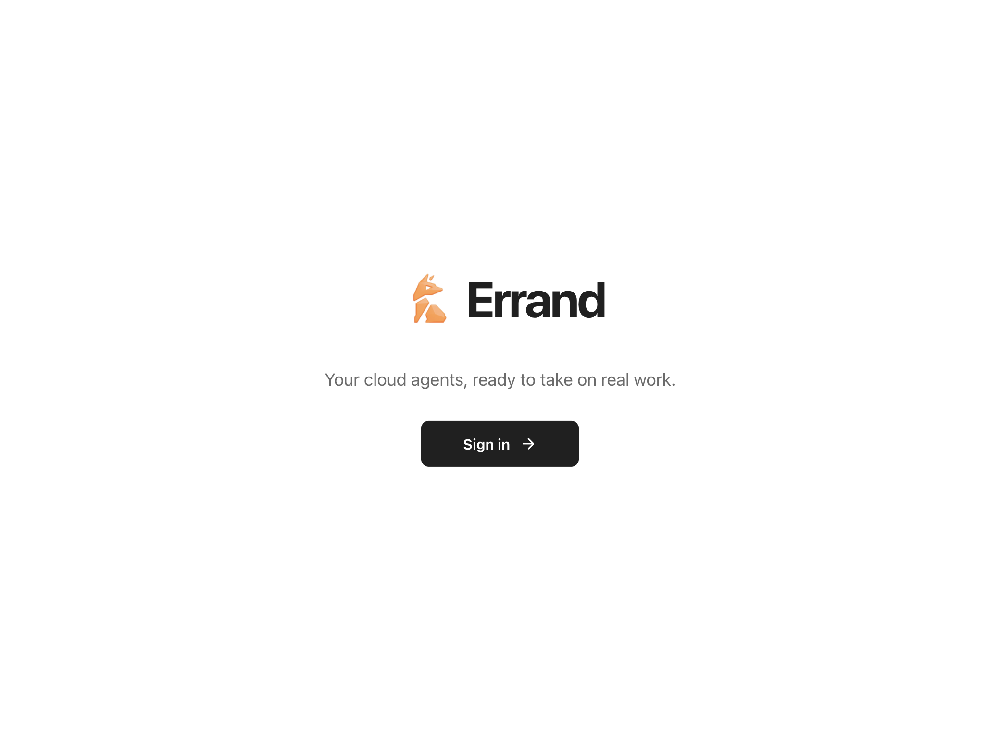

<div align="center">

# Errand

### Your cloud agents, ready to take on real work.

Build your AI team. Give them a job. Come back to finished work.

[Runta](https://runta.com) · macOS · Powered by Runta Cloud Agents

</div>



## Your AI team has a computer now

Errand is a desktop home for persistent cloud agents. Each teammate runs inside its own Runta Runtime, keeps its workspace, and continues working after you close the app.

No tab jungle. No babysitting terminal sessions. Just message your agents and let them work.

## Built for delegation

- **Agents that stick around** — create focused agents with persistent cloud workspaces.
- **Real work, not chat theater** — follow live activity, tool use, approvals, and results.
- **Pick up where you left off** — conversations and completed runs stay with each agent.
- **Cloud-native by default** — the desktop app connects directly to Runta Cloud Agents.
- **Quietly native** — a fast, minimal macOS experience with notifications and deep links.
- **Secure at the boundary** — device authorization and credentials protected by Electron `safeStorage`.

## Run it locally

Requires macOS, Node.js 22+, and npm 10+.

```bash
git clone https://github.com/runta-dev/runta-crew.git
cd runta-crew
npm ci
npm run dev
```

The app defaults to:

- Cloud Agents API: `https://api.runta.me`
- Runta Dashboard: `https://dashboard.runta.me`

Development builds can override these addresses in Connection settings. The E2E script accepts a `ERRAND_E2E_ENDPOINT` override.

Errand uses the real Cloud Agents API. There is no local demo transport or silent mock fallback.

## Ship with confidence

```bash
npm run typecheck
npm run lint
npm test
npm run build
```

For the authenticated end-to-end flow:

```bash
ERRAND_E2E_TOKEN=... npm run test:e2e
```

Package and smoke-test the macOS app:

```bash
npm run package
npm run smoke
```

Artifacts are written to `release/`. `npm run package` creates ad-hoc signed builds for local testing; these are not public distribution artifacts.

Packaging converts the DMG to native ULMO (LZMA level 9), verifies its contents, and refreshes its blockmap and update metadata. ULMO requires macOS 10.15 or later; Errand requires macOS 13 or later. The DMG compression step leaves ZIP artifacts unchanged.

## Signed macOS releases

The [release workflow](.github/workflows/publish-release.yml) runs `npm run package:release`. Public releases require a real **Developer ID Application** certificate, successful Apple notarization, and stapled app and DMG tickets. ULMO level 9 compression happens before final DMG signing; release hashes, blockmaps, and update metadata must describe the final artifacts.

Configure these values in **runta-dev/runta-crew → Settings → Secrets and variables → Actions**, using **New repository secret** and **New repository variable**:

| Kind | Name | Value |
| --- | --- | --- |
| Secret | `APPLE_CERTIFICATE_BASE64` | Base64 of a Developer ID Application `.p12` export containing its private key. |
| Secret | `APPLE_CERTIFICATE_PASSWORD` | Password protecting that `.p12` export. |
| Secret | `APPLE_NOTARY_KEY_BASE64` | Base64 of an App Store Connect team API key `.p8` file. |
| Variable | `APPLE_NOTARY_KEY_ID` | The API key's Key ID. |
| Variable | `APPLE_NOTARY_ISSUER_ID` | The team's Issuer ID. |

These names follow the [Runta CLI release workflow](https://github.com/runta-dev/runta/blob/integration/.github/workflows/publish-release.yml). Store all five values at repository scope in `runta-crew`; the workflow reads them through its existing `secrets` and `vars` contexts. Its `apple-release` environment remains the release job's environment, with no duplicate values required there.

On macOS, copy each encoded file directly to the clipboard, then paste it into the matching GitHub secret before running the next command:

```bash
# Paste into APPLE_CERTIFICATE_BASE64.
base64 < "/path/to/DeveloperIDApplication.p12" | tr -d '\n' | pbcopy

# Paste into APPLE_NOTARY_KEY_BASE64.
base64 < "/path/to/AuthKey.p8" | tr -d '\n' | pbcopy
```

Enter the certificate password directly in GitHub's secret form. Keep private keys and passwords out of commits, logs, terminal arguments, and chat.

Once the workflow is on the repository's default branch, **Actions → Publish macOS Release** provides manual runs with `dry_run=true` by default. Enter a tag matching `package.json`'s version, with an optional `v` prefix. The optional `ref` override is available only for dry runs; otherwise the workflow builds the release tag.

To validate a feature branch before the release workflow reaches the default branch, dispatch the existing **CI** workflow on that branch with `signed_release=true` and `release_tag` matching `package.json`. This entry reuses the release workflow in dry-run mode, including signing, notarization, and artifact verification.

A dry run still performs signing, notarization, stapling, and verification, then saves DMG, ZIP, blockmaps, and `latest-mac.yml` in the Actions artifact `errand-macos-arm64-<version>`. It skips GitHub Release uploads. Publishing a GitHub Release triggers the workflow automatically; a manual run with `dry_run=false` uploads to an existing release. Use a dry run to validate the environment first.

## Upgrade compatibility

Quit Runta Crew before opening Errand for the first time. Errand keeps the existing `com.runta.crew` application identity and `Runta Crew` local profile and keychain namespace so upgrades retain settings, credentials, and browser data. Existing `runta-crew://agent/...` links, backend client identifiers, and `RUNTA_CREW_*` development environment variables remain supported alongside the new `errand://` links and `ERRAND_*` variables. The GitHub repository and Runta service endpoints retain their existing addresses.

## Under the hood

Errand keeps the security boundary small: Electron main owns native lifecycle, authorization, encrypted credentials, and the allowlisted Cloud API broker; preload exposes a narrow typed bridge; React handles the product experience.
