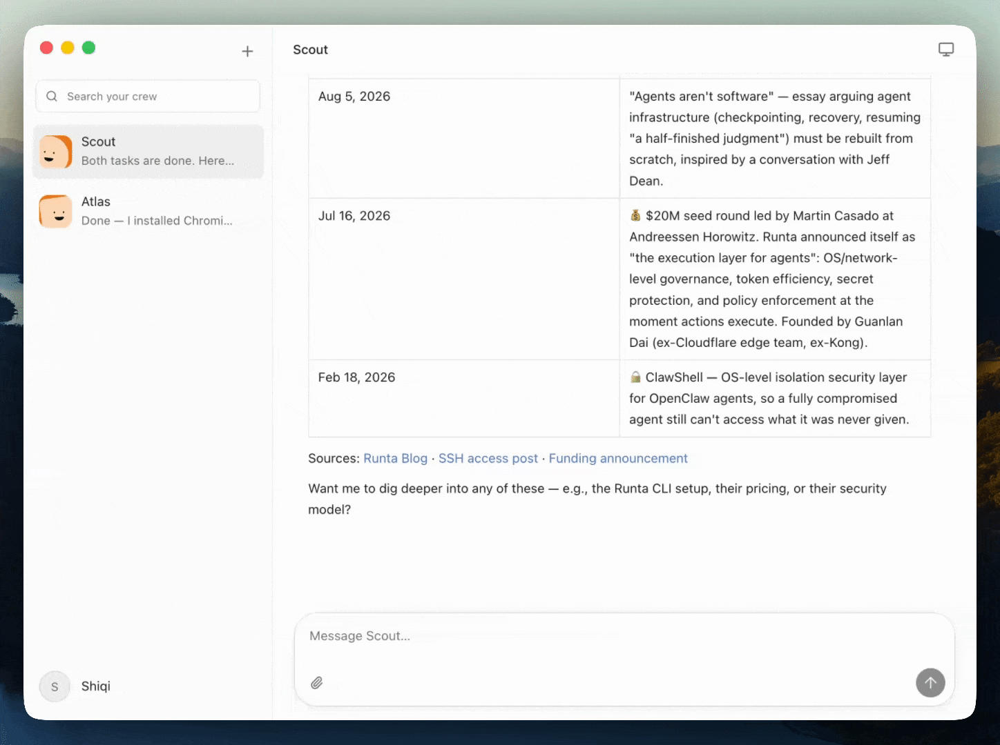

<div align="center">

# Runta Crew

### Your cloud agents, ready to take on real work.

Create a crew. Give them a job. Come back to finished work.

[Runta](https://runta.com) · macOS · Powered by Runta Cloud Agents

</div>



## Your AI team has a computer now

Runta Crew is a desktop home for persistent cloud agents. Each teammate runs inside its own Runta Runtime, keeps its workspace, and continues working after you close the app.

No tab jungle. No babysitting terminal sessions. Just message your crew and let them work.

## Built for delegation

- **A crew that sticks around** — create focused agents with persistent cloud workspaces.
- **Real work, not chat theater** — follow live activity, tool use, approvals, and results.
- **Pick up where you left off** — conversations and completed runs stay with each agent.
- **Cloud-native by default** — the desktop app connects directly to Runta Cloud Agents.
- **Quietly native** — a fast, minimal macOS experience with notifications and deep links.
- **Secure at the boundary** — device authorization and credentials protected by Electron `safeStorage`.

## Run it locally

Requires macOS, Node.js 22+, and npm 10+.

```bash
git clone https://github.com/runta-dev/runta-crew.git
cd runta-crew
npm ci
npm run dev
```

The development app connects to:

- Cloud Agents API: `https://api.runta.com`
- Runta Dashboard: `https://dashboard.runta.com`

Runta Crew uses the real Cloud Agents API. There is no local demo transport or silent mock fallback.

## Ship with confidence

```bash
npm run typecheck
npm run lint
npm test
npm run build
```

For the authenticated end-to-end flow:

```bash
RUNTA_CREW_E2E_TOKEN=... npm run test:e2e
```

Package and smoke-test the macOS app:

```bash
npm run package
npm run smoke
```

Artifacts are written to `release/`. Local builds are ad-hoc signed; public distribution requires Runta signing, notarization, and an approved update channel.

## Under the hood

Runta Crew keeps the security boundary small: Electron main owns native lifecycle, authorization, encrypted credentials, and the allowlisted Cloud API broker; preload exposes a narrow typed bridge; React handles the product experience.
