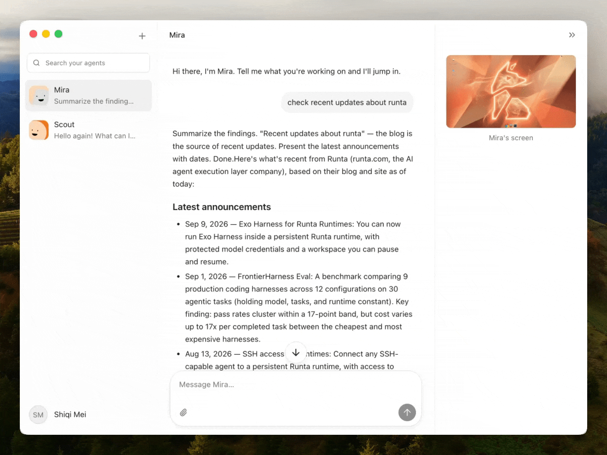

<div align="center">


# Errand

### Give your agents a computer. Then give them a job.

A desktop home for persistent AI teammates, powered by Runta.

[](#quick-start) [](#quick-start) [](https://www.electronjs.org/) [](https://www.typescriptlang.org/) [](https://runta.com/)

**[Quick start](#quick-start)** · **[Releases](https://github.com/runta-dev/runta-crew/releases)** · **[How it works](#how-it-works)** · **[Discord](https://discord.gg/62d4bkaTnS)**



<sub>Your agents have a workspace to come back to. So do you.</sub>

</div>

## Meet your new teammates

Create an agent, give it a task, and follow its work from your Mac. Each agent has its own cloud computer, files, and conversation history. Close the app and return to the same workspace later.

Errand brings persistent agents into a familiar desktop experience: a team in the sidebar, a conversation for each agent, and a live view of the computer doing the work.

<table>
<tr>
<td width="50%" valign="top">

### 🖥️ A computer for every agent

Each agent runs in its own Runta Runtime, with a cloud workspace for its files, tools, and ongoing work.

</td>
<td width="50%" valign="top">

### 💬 Keep the conversation going

Return to previous conversations and completed runs. Send a follow-up without rebuilding the context from scratch.

</td>
</tr>
<tr>
<td width="50%" valign="top">

### 👀 See the work happen

Follow tool activity and available output. Open the live desktop when you need to see what the agent sees.

</td>
<td width="50%" valign="top">

### 🖼️ Show what you mean

Attach an image to your message and send it as native image input to the agent. Attachments stay with the conversation.

</td>
</tr>
<tr>
<td width="50%" valign="top">

### ☁️ Pick up where you left off

Execution lives in the cloud. Reopen Errand to reconnect with your agents and retrieve their latest work.

</td>
<td width="50%" valign="top">

### 🔐 Keep credentials protected

Browser-based authorization and OS-backed credential encryption, with a narrow bridge between the UI and native code.

</td>
</tr>
</table>

## Quick start

**macOS 13+ · Apple Silicon · Node.js 22–26 · npm 10+**

```bash
git clone https://github.com/runta-dev/runta-crew.git
cd runta-crew
npm ci
npm run dev
```

1. **Sign in** through your browser using your Runta account.
2. **Create an agent** and give it a focused job.
3. **Follow the work** in the conversation, tool activity, or live desktop.

Running the desktop app locally connects to **Runta Cloud Agents**. You need a Runta account and model access configured for your agents.

<details>
<summary><strong>Connection settings</strong></summary>

The app defaults to:

| Service | Address |
| --- | --- |
| Cloud Agents API | `https://api.runta.me` |
| Runta Dashboard | `https://dashboard.runta.me` |

Development builds can override these addresses in **Connection settings**. The E2E script accepts an `ERRAND_E2E_ENDPOINT` override.

</details>

## How it works

```text
Your Mac                          Runta Cloud
┌─────────────────────┐           ┌──────────────────────────┐
│ Errand              │           │ Cloud Agents API         │
│                     │           │                          │
│ Conversations       │ ◀───────▶ │ Agents · Runs · Events   │
│ Activity & results  │           │ Artifacts · Sessions     │
│ Live computer view  │           └────────────┬─────────────┘
└─────────────────────┘                        │
                                  ┌────────────▼─────────────┐
                                  │ Each agent's runtime     │
                                  │ Files · Tools · Browser  │
                                  └──────────────────────────┘
```

The **React renderer** handles the interface. A **typed preload bridge** exposes specific desktop operations. **Electron main** owns authentication, encrypted credentials, and the allowlisted Cloud API broker. **Runta** provides the agent runtimes and their lifecycle.

The desktop client and Runta transport are separate layers. Connecting a different backend requires implementing the agent, run, event, artifact, and computer-session contracts.

## Build with us

Found a rough edge? [Open an issue](https://github.com/runta-dev/runta-crew/issues). Have an improvement? [Send a pull request](https://github.com/runta-dev/runta-crew/pulls).

Useful contributions include clearer activity and error states, more accessible interactions, and reproducible reports of connection or attachment problems. Include the steps to reproduce, what you expected, and what happened.

```bash
npm run typecheck
npm run lint
npm test
npm run build
```

<details>
<summary><strong>Authenticated end-to-end checks</strong></summary>

```bash
ERRAND_E2E_TOKEN=... npm run test:e2e
```

Use a test account and keep tokens out of commits and logs.

</details>

<details>
<summary><strong>Local macOS packaging</strong></summary>

```bash
npm run package
npm run smoke
```

Artifacts are written to `release/`. Local packaging creates ad-hoc signed builds for testing. Use the signed release workflow for distribution.

The DMG uses native ULMO (LZMA level 9) compression. Packaging verifies its contents and refreshes its blockmap and update metadata. Errand requires macOS 13 or later. ZIP artifacts are unchanged by the DMG compression step.

</details>

<details>
<summary><strong>Release signing and notarization</strong></summary>

The [release workflow](.github/workflows/publish-release.yml) runs `npm run package:release`. Public releases require a real **Developer ID Application** certificate, successful Apple notarization, and stapled app and DMG tickets. ULMO level 9 compression happens before final DMG signing; release hashes, blockmaps, and update metadata must describe the final artifacts.

Configure these values in **runta-dev/runta-crew → Settings → Secrets and variables → Actions**, using **New repository secret** and **New repository variable**:

| Kind | Name | Value |
| --- | --- | --- |
| Secret | `APPLE_CERTIFICATE_BASE64` | Base64 of a Developer ID Application `.p12` export containing its private key. |
| Secret | `APPLE_CERTIFICATE_PASSWORD` | Password protecting that `.p12` export. |
| Secret | `APPLE_NOTARY_KEY_BASE64` | Base64 of an App Store Connect team API key `.p8` file. |
| Variable | `APPLE_NOTARY_KEY_ID` | The API key's Key ID. |
| Variable | `APPLE_NOTARY_ISSUER_ID` | The team's Issuer ID. |

These names follow the [Runta CLI release workflow](https://github.com/runta-dev/runta/blob/integration/.github/workflows/publish-release.yml). Store all five values at repository scope in `runta-crew`; the workflow reads them through its existing `secrets` and `vars` contexts. Its `apple-release` environment remains the release job's environment, with no duplicate values required there.

On macOS, copy each encoded file directly to the clipboard, then paste it into the matching GitHub secret before running the next command:

```bash
# Paste into APPLE_CERTIFICATE_BASE64.
base64 < "/path/to/DeveloperIDApplication.p12" | tr -d '\n' | pbcopy

# Paste into APPLE_NOTARY_KEY_BASE64.
base64 < "/path/to/AuthKey.p8" | tr -d '\n' | pbcopy
```

Enter the certificate password directly in GitHub's secret form. Keep private keys and passwords out of commits, logs, terminal arguments, and chat.

Once the workflow is on the repository's default branch, **Actions → Publish macOS Release** provides manual runs with `dry_run=true` by default. Enter a tag matching `package.json`'s version, with an optional `v` prefix. The optional `ref` override is available only for dry runs; otherwise the workflow builds the release tag.

To validate a feature branch before the release workflow reaches the default branch, dispatch the existing **CI** workflow on that branch with `signed_release=true` and `release_tag` matching `package.json`. This entry reuses the release workflow in dry-run mode, including signing, notarization, and artifact verification.

A dry run still performs signing, notarization, stapling, and verification, then saves DMG, ZIP, blockmaps, and `latest-mac.yml` in the Actions artifact `errand-macos-arm64-<version>`. It skips GitHub Release uploads. Publishing a GitHub Release triggers the workflow automatically; a manual run with `dry_run=false` uploads to an existing release. Use a dry run to validate the environment first.

</details>

<details>
<summary><strong>Upgrading from Runta Crew</strong></summary>

Errand uses its own `Errand Safe Storage` macOS keychain entry and `~/Library/Application Support/Errand` profile. The first launch starts signed out; authorize Errand again to access your existing cloud agents. Legacy Runta Crew credentials, settings, and browser data remain untouched and are not migrated or decrypted. The `com.runta.crew` application identity stays unchanged for signed updates. Existing `runta-crew://agent/...` links, backend client identifiers, and `RUNTA_CREW_*` development environment variables remain supported alongside the new `errand://` links and `ERRAND_*` variables. The GitHub repository and Runta service endpoints retain their existing addresses.

</details>

## Credits

The Errand [SVG icon](src/assets/errand-icon.svg) uses the same `beam` variant of [boring-avatars](https://github.com/boringdesigners/boring-avatars) as the agents in the app. The Dock icon uses the selected Atlas seed with the app's original palette, configured in `src/shared/avatarStyle.json`; the generated avatar artwork is unchanged apart from the macOS icon mask and padding. `npm run build:icons` generates the SVG, PNG, and macOS ICNS files; development and release builds run it automatically. The app, Dock, and installer use the same artwork. The library's MIT notice is included in the packaged app.

The project is built with [Electron](https://www.electronjs.org/), [React](https://react.dev/), [TypeScript](https://www.typescriptlang.org/), and [noVNC](https://novnc.com/), on [Runta Cloud Agents](https://runta.com/).

---

<div align="center">

**If Errand earns a place in your Dock, [give it a star](https://github.com/runta-dev/runta-crew). ⭐**

Built by [Runta](https://runta.com/) · [Join the conversation](https://discord.gg/62d4bkaTnS)

</div>
