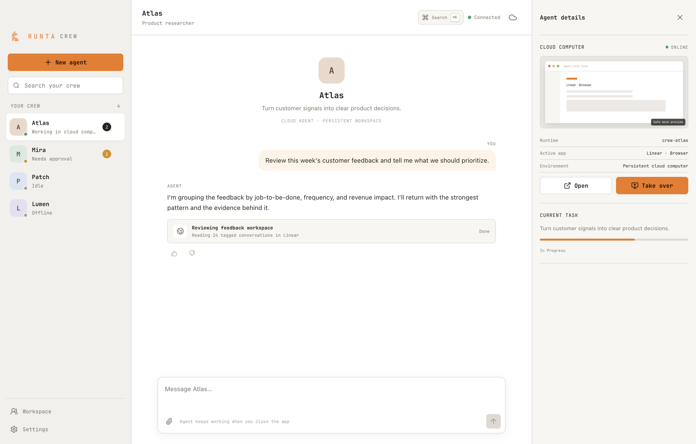

# Runta Crew

Runta Crew is the desktop client for creating, messaging, and supervising Runta Cloud Agents. Each agent is modeled as a persistent AI teammate working inside a Runta Runtime cloud computer.



> **Current status:** this repository is an installable Electron MVP running entirely against `MockCloudAgentsClient`. It is not connected to the Runta Cloud Agents service, and the computer preview is intentionally labeled as a mock. See [API_INTEGRATION.md](./API_INTEGRATION.md) for the backend contract still to be confirmed.

## What works today

- Search, switch, and create named agents with roles and goals.
- Edit, pin, duplicate, mark read/unread, and safely delete agents.
- Display working, idle, approval-required, and offline states.
- Persistent-style conversations with user, agent, system, and activity data models.
- Mock streaming responses and structured browser/file activity.
- Native attachment selection with opaque IDs, safe metadata previews, removal, and size validation.
- Useful/needs-work message reactions.
- Scoped approval review with explicit Allow once / Deny actions and notes.
- Cloud computer status plus safe mock Open / Take over surfaces.
- Connection, theme, notification, credential, and About settings.
- OS-encrypted credential storage through Electron `safeStorage`.
- Focus-aware OS notifications and macOS unread dock badges.
- macOS native window/menu, DMG/ZIP packaging, and a native packaged-app smoke check.

## Development

Requires Node.js 22+ and npm 10+ on macOS.

```bash
npm ci
npm run dev
```

The first screen uses the light theme. No account or backend is required in mock mode.

## Verification

```bash
npm run typecheck
npm run lint
npm test
npm run build
npm run package
npm run smoke
```

Packaged artifacts are written under `release/`. The app is ad-hoc signed for local development; production distribution will require the Runta Developer ID identity, notarization, and an approved update service.

## Architecture

- `electron/main`: native window lifecycle, safe external navigation, settings persistence, OS credential encryption.
- `electron/preload`: small typed bridge; no generic IPC or Node primitives.
- `src/domain`: stable Cloud Agents types and ports.
- `src/clients/mock`: local demo transport and separate fixtures.
- `src/clients/http`: endpoint/auth/error/cancellation adapter with route injection.
- `src/state`: renderer orchestration and event subscription lifecycle.
- `src/ui`: presentation and focused interaction components.

See [ARCHITECTURE.md](./ARCHITECTURE.md) for process and security boundaries.

## Relationship to the reference project

Grok Bot 0.18 Reconstructed was used only to study the high-level product shape and Electron boundaries. Its provenance states that no upstream source-code license is implied. Runta Crew therefore contains an independent implementation and does not copy its source, binaries, assets, private interfaces, account system, telemetry, updater, or trademarks.
